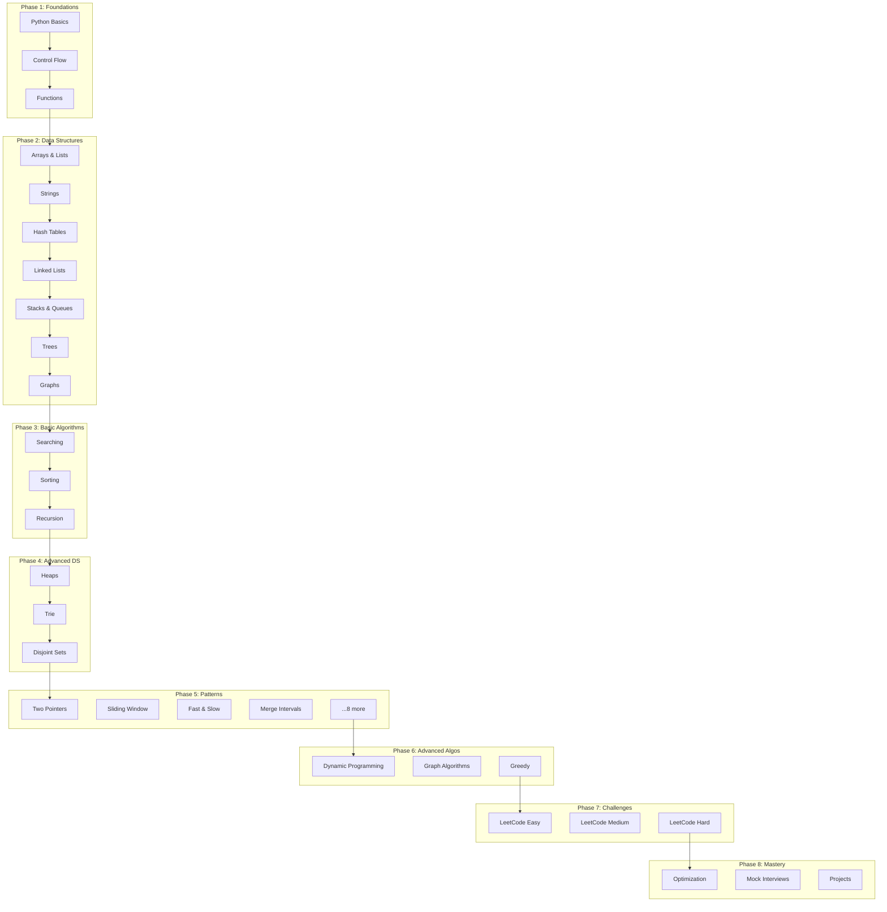

# Learning Roadmap

Your 8-phase journey from Python basics to algorithm mastery.

## Visual Overview

---

## Phase Details

### Phase 1: Foundations (2 weeks)

**Goal:** Master Python fundamentals

| Module | Topics | Time |
|--------|--------|------|
| Python Basics | Variables, data types, operators | 3 days |
| Control Flow | Conditionals, loops, comprehensions | 4 days |
| Functions | Def, decorators, generators, lambdas | 5 days |

**Deliverables:**
- [ ] Complete all exercises in `build/foundations/`
- [ ] Pass foundations tests with 80%+ coverage
- [ ] Earn 🐍 Python Novice badge

---

### Phase 2: Data Structures (4 weeks)

**Goal:** Implement and understand core data structures

| Module | Topics | Time |
|--------|--------|------|
| Arrays & Lists | Operations, slicing, complexity | 3 days |
| Strings | Methods, pattern matching | 2 days |
| Hash Tables | Dict, sets, collisions | 3 days |
| Linked Lists | Singly, doubly, circular | 4 days |
| Stacks & Queues | LIFO, FIFO, implementations | 3 days |
| Trees | Binary, BST, heap, trie | 5 days |
| Graphs | Representations, basics | 3 days |

**Deliverables:**
- [ ] Implement each data structure from scratch
- [ ] Understand time/space complexity for each operation
- [ ] Earn 📊 Data Master badge

---

### Phase 3: Basic Algorithms (3 weeks)

**Goal:** Master fundamental algorithms

| Module | Topics | Time |
|--------|--------|------|
| Searching | Linear, binary, interpolation | 4 days |
| Sorting | All major O(n²) and O(n log n) sorts | 7 days |
| Recursion | Basics, backtracking, call stack | 5 days |

**Deliverables:**
- [ ] Implement all sorting algorithms from scratch
- [ ] Understand when to use each algorithm
- [ ] Visualize at least 3 algorithms

---

### Phase 4: Advanced Data Structures (3 weeks)

**Goal:** Master complex data structures

| Module | Topics | Time |
|--------|--------|------|
| Heaps | Min/max heap, priority queue | 4 days |
| Trie | Prefix tree, autocomplete | 4 days |
| Disjoint Sets | Union-Find, path compression | 3 days |

**Deliverables:**
- [ ] Implement heap from scratch
- [ ] Build autocomplete with trie
- [ ] Solve union-find problems

---

### Phase 5: Coding Patterns (4 weeks)

**Goal:** Learn patterns that solve 80% of interview problems

| Pattern | Use Case | Time |
|---------|----------|------|
| Two Pointers | Array problems, palindromes | 2 days |
| Sliding Window | Subarray/substring problems | 3 days |
| Fast & Slow | Cycle detection, middle element | 2 days |
| Merge Intervals | Overlapping intervals | 2 days |
| Cyclic Sort | Array in range [1, n] | 2 days |
| Island Pattern | Matrix DFS/BFS | 3 days |
| Tree BFS/DFS | Level traversal, paths | 3 days |
| Two Heaps | Median, scheduling | 3 days |
| Subsets | Permutations, combinations | 2 days |
| Modified Binary Search | Rotated arrays, unknown size | 3 days |
| Top K Elements | Kth largest/smallest | 2 days |
| K-way Merge | Merge K sorted lists | 2 days |

**Deliverables:**
- [ ] Complete 3+ problems per pattern
- [ ] Create personal pattern recognition checklist
- [ ] Earn 🧩 Pattern Pro badge

---

### Phase 6: Advanced Algorithms (4 weeks)

**Goal:** Master dynamic programming and graph algorithms

| Module | Topics | Time |
|--------|--------|------|
| Dynamic Programming | Memoization, tabulation, classic problems | 10 days |
| Graph Algorithms | BFS, DFS, Dijkstra, topological sort | 8 days |
| Greedy | Activity selection, Huffman | 4 days |

**Deliverables:**
- [ ] Solve 20+ DP problems
- [ ] Implement graph algorithms from scratch
- [ ] Earn ⚡ Algo Ninja badge

---

### Phase 7: Challenges (Ongoing)

**Goal:** Apply knowledge through practice

| Difficulty | Count | Focus |
|------------|-------|-------|
| Easy | 50+ | Pattern recognition |
| Medium | 30+ | Algorithm design |
| Hard | 10+ | Optimization |

**Deliverables:**
- [ ] Complete 25 Easy problems
- [ ] Complete 25 Medium problems
- [ ] Complete 10 Hard problems
- [ ] Earn 🏆 Interview Ready badge

---

### Phase 8: Mastery (Ongoing)

**Goal:** Become interview-ready and beyond

| Focus | Activities |
|-------|------------|
| Optimization | Improve time/space complexity |
| Mock Interviews | Practice with timer, whiteboard |
| Real Projects | Build something using learned concepts |

**Deliverables:**
- [ ] Optimize 10 solutions
- [ ] Complete 5 mock interviews
- [ ] Build 1 real project
- [ ] Earn 💎 OCTALUM Scholar badge

---

## Time Estimates

| Phase | Minimum | Recommended |
|-------|---------|-------------|
| 1. Foundations | 1 week | 2 weeks |
| 2. Data Structures | 3 weeks | 4 weeks |
| 3. Basic Algorithms | 2 weeks | 3 weeks |
| 4. Advanced DS | 2 weeks | 3 weeks |
| 5. Patterns | 3 weeks | 4 weeks |
| 6. Advanced Algos | 3 weeks | 4 weeks |
| 7. Challenges | Ongoing | Ongoing |
| 8. Mastery | Ongoing | Ongoing |

**Total:** ~20-24 weeks for complete mastery

---

## Tips for Success

### Daily Practice
- 30-60 minutes daily beats weekend cramming
- Review previous concepts regularly

### Active Learning
- Type code, don't copy-paste
- Explain concepts out loud
- Teach someone else

### Pattern Recognition
- After solving, identify the pattern
- Create personal pattern library
- Review patterns weekly

### Don't Rush
- Understanding > Speed
- Quality > Quantity
- Depth > Breadth

---

*Ready to start? Open [PROGRESS.md](../PROGRESS.md) and begin Phase 1!*
